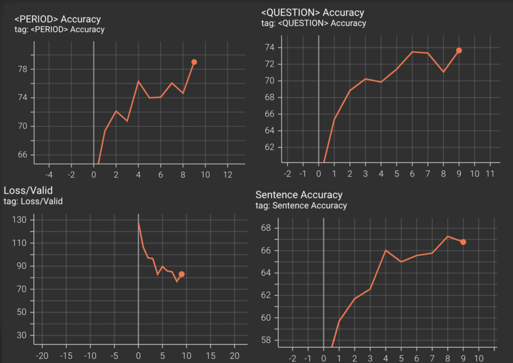

# Punctuation-Prediction
Predict punctuation(".", "?) in text by Deep Neural Network

## Preparation

1. Directory Setting
```C
% mkdir -p data/source data/merged data/training
```
2. Prepare several text files in data/source

3. Merge all text files to one 'merged.txt' (merged.txt will be saved in data/merged/merged.txt)
```C
% python create_data.py --task merge --input_dir data/source --output_dir data/merged
```

4. Change punctuation to special token (Create input text files for training)
- Open config.yaml and set split_ratio you want
- data/training/train.txt, data/training/valid.txt, data/training/test.txt will be created
```C
% python create_data.py \
    --task create_and_split 
    --input_dir data/merged 
    -output_dir data/training
```

## Training

1. The model will be saved in output_dir 
```C
% python train.py \
    --train_path data/training/train.txt
    --valid_path data/training/valid.txt 
    --test_path data/training/test.txt --output_dir output
```

2. Tensorboard Results
```C
% tensorboard --logdir=./runs
```
- Sentence Accuracy = 100 * (Correctly Predict Sentences / Sentences)
- Period Accuracy = 100 * (Correctly Predict Period / Period labels)
- Question Accuracy = 100 * (Correctly Question Period / Question labels)




## Inference
1. Generate Punctuation for non-punctuated text file
- Prepare text file which doesn't contain any punctuation
```
% python inference.py \
    --type predict_unlabeled_data \
    --checkpoint_path output/checkpoint-best.pt \
    --unlabeled_path data/test/{filename}.txt 
```


2. Calculate Accuracy for labeled text file

- Prepare labeled text file (punctuations are already existed). Run create_data.py to generate chosen punctuation marks
- {filename}-labeled.txt will be saved in same directory
```C
% python create_data.py \
    --task create_and_split
    --path_for_inference data/test/{filename}.txt
```

- Calculate Inference
```C
% python inference.py \
    --type test_labeled_data 
    --checkpoint_path output/checkpoint-best.pt 
    --labeled_path data/test/{filename}-labeled.txt
```

